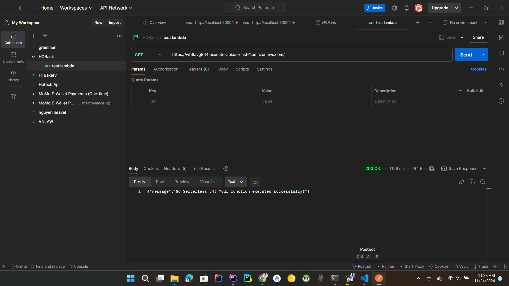
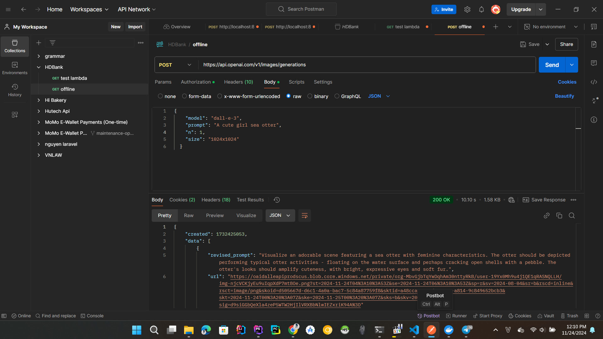
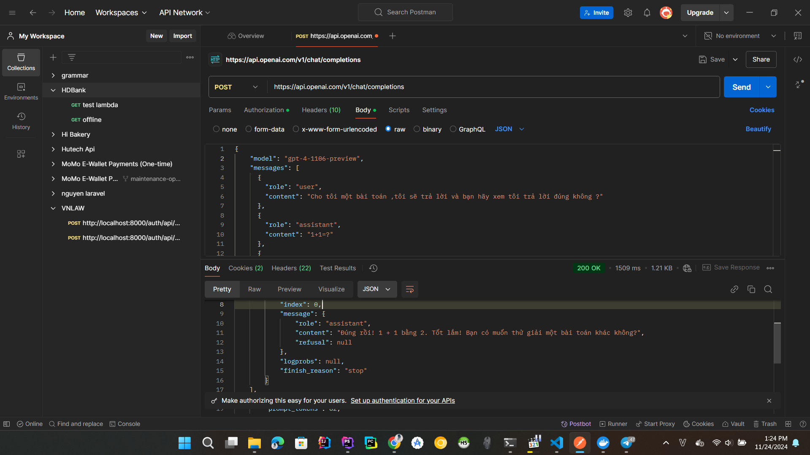
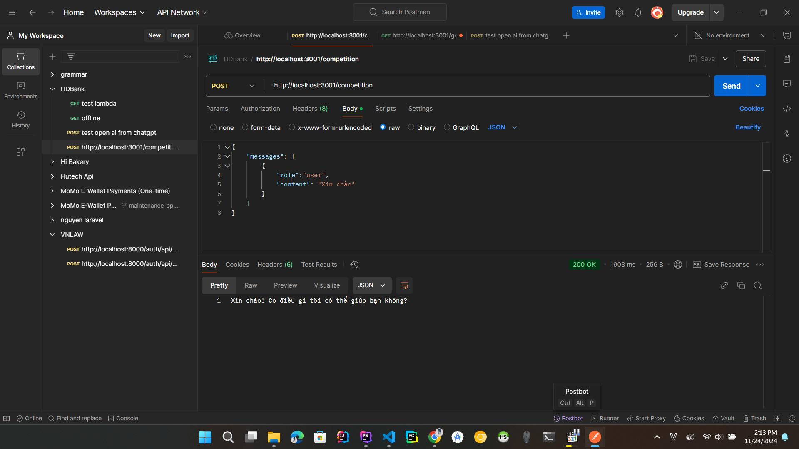

# Thực Hành AWS + Open AI

## AWS

### Bước 1 : Tạo tài khoản AWS

- Truy cập vào trang chủ của AWS để đăng kí : [AWS-Register](https://signin.aws.amazon.com/signup?request_type=register/)

### Bước 2 : Cài đặt Serverless framework

Để biết chi tiết : [Serverless](https://www.serverless.com/framework/docs/getting-started#setting-up-serverless-framework-with-aws)

- Cài đặt npm (Node.js) : [Node.js](https://nodejs.org/en/download/)
- Cài đặt serverless framework
```bash
  npm i serverless -g
```

Có thể kiểm tra bằng cách gõ lệnh sau :
```bash
  serverless --version
```

### Bước 3 : Tạo project

- Tạo project mới
```bash
  serverless
```

- Chọn template

```bash
Serverless ϟ Framework
Welcome to Serverless Framework V.4
Create a new project by selecting a Template to generate scaffolding for a specific use-case.
? Select A Template: …
❯ AWS / Node.js / Starter
  AWS / Node.js / HTTP API
  AWS / Node.js / Scheduled Task
  AWS / Node.js / SQS Worker
  AWS / Node.js / Express API
  AWS / Node.js / Express API with DynamoDB
  AWS / Python / Starter
  AWS / Python / HTTP API
  AWS / Python / Scheduled Task
  AWS / Python / SQS Worker
  AWS / Python / Flask API
  AWS / Python / Flask API with DynamoDB
  (Scroll for more)
```

- Chọn tên project

```bash
√ Name Your Project: · lambda
```

- Đăng Nhập vào Serverless

```bash
√ Serverless Framework V4 CLI is free for developers and organizations making less than $2 million annually, but requires an account or a license key.

Please login/register or enter your license key: · Login/Register
✔ You have successfully signed in.
```

- Chọn hoặc tạo app

```bash
√ Create Or Select An Existing App: · Create A New App

√ Name Your New App: · hdbank
```

- Setup AWS credentials

```bash
√ AWS Credentials Set-Up Method: · Create AWS IAM Role (Easy & Recommended)
```

- Ta có dự án như name project đã tạo ở trên

```bash
    cd lambda
```

### Bước 4 : Deploy

- Thêm --verbose để xem chi tiết

```bash
  serverless deploy --verbose
```

**OR**

```bash
  serverless deploy
```

- Thử chạy trên postman



### Cách Update
    
```bash
    serverless deploy
```

### Giải thích các biến trong serverless.yml

```yaml
functions:
  hello: # tên function
    handler: handler.hello # tên file và tên function
    events:
      - httpApi: # loại event (httpApi, http, s3, sqs, sns, schedule)
          path: / # đường dẫn
          method: get # phương thức (get, post, put, delete)
```

### Chạy offline

- Cài đặt plugin

```bash
npm install serverless-offline --save-dev
```

- Thêm vào serverless.yml

```yaml
plugins:
  - serverless-offline

custom: # Nếu muốn thay đổi port mặc định ( 3000 )
  serverless-offline:
    httpPort: 3001
```

- Chạy

```bash
  serverless offline
```

## OpenAI

### Bước 1 : Tạo key API

- Truy cập vào trang chủ của OpenAI để tạo key : [APIKeys](https://platform.openai.com/settings/api-keys)

### Bước 2 :Thử Trên Postman

- dall 3e : tạo hình ảnh từ mô tả



- completions : có thể ứng dụng làm chatbot ,...

- 

## Tích hợp Api Open AI vào Serverless

### Tạo file .env

```bash
  touch .env
```

### Thêm key vào file .env **Hoặc** thêm vào serverless.yml

- .env
```bash
  OPENAI_API_KEY=sk-...
```

- serverless.yml
```yaml
provider:
  environment:
    OPENAI_API_KEY: sk-....
```

### Cài đặt thư viện

```bash
  npm install axios
```

### Thêm vào handler.js

```javascript
import axios from 'axios';
import dotenv from 'dotenv';
dotenv.config();

export async function callOpenAI (event) {
  const { messages } = JSON.parse(event.body);
  try {
    const response = await axios.post('https://api.openai.com/v1/chat/completions', {
      model: 'gpt-4-1106-preview',
      messages: messages,
      temperature: 0.7,
    }, {
      headers: {
        "Content-Type": "application/json",
        'Authorization': `Bearer ${process.env.OPENAI_API_KEY}`
      }
    });
    return response.data.choices[0].message.content;
  } catch (error) {
    console.error(error);
    throw new Error("Failed to call OpenAI API");
  }
}
```

### Thêm vào serverless.yml

```yaml
  competition:
    handler: handler.callOpenAI
    events:
      - httpApi:
          path: /competition
          method: post
          cors: true
```

